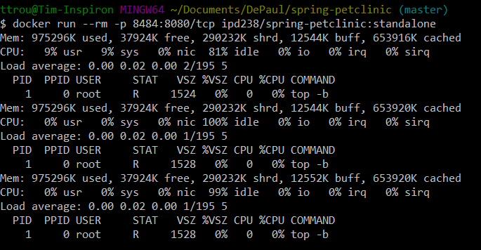

Homework 8
==========

[Dockerfile](Dockerfile)

Running Docker Instance

I could not figure out how to access the container to see the main page of the app (after several hours of troubleshooting and switching between Docker Toolbox and Docker Desktop on two different Windows machines running different versions of Windows 10)